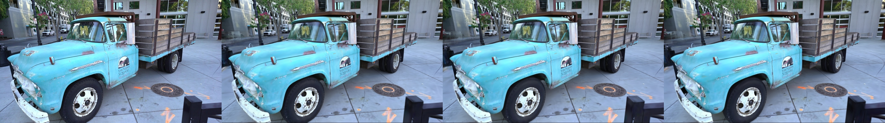

# NormLightGaussian: 3D Gaussian Splatting for Real lighting scene and Specular Object Reflection
author<br>
| [Webpage](https://) | [Full Paper](https://) | [Video](https://) |[Evaluation Images](https://) |<br>


This repository contains the official authors implementation associated with the paper "3D Gaussian Splatting for Real-Time Radiance Field Rendering", which can be found [here](https://repo-sam.inria.fr/fungraph/3d-gaussian-splatting/). We further provide the reference images used to create the error metrics reported in the paper, as well as recently created, pre-trained models. 


Abstract: **


## Cloning the Repository
```shell
# SSH
git clone https://github.com/3DHumanRehab/NormLightGaussian.git
```

The repository contains submodules are the same as 3D Gaussian Splatting.
```shell
# SSH
git clone git@github.com:graphdeco-inria/gaussian-splatting.git --recursive
```

## Overview


## Optimizer

The optimizer uses PyTorch and CUDA extensions in a Python environment to produce trained models. 

### Environment Requirements
we use the same environment as 3D Gaussian Splatting.

### Train

```shell
python train.py -s <path to COLMAP or NeRF Synthetic dataset> -- model norm_mlp_opacity # Train
```
you can specify model:original, norm_light, norm_mlp, norm_mlp_opacity
### Render and Eval

```shell
python train.py -s <path to COLMAP or NeRF Synthetic dataset> -- model norm_mlp_opacity --eval # Train with train/test split
python render.py -m <path to trained model> # Generate renderings
python metrics.py -m <path to trained model> # Compute error metrics on renderings
```
